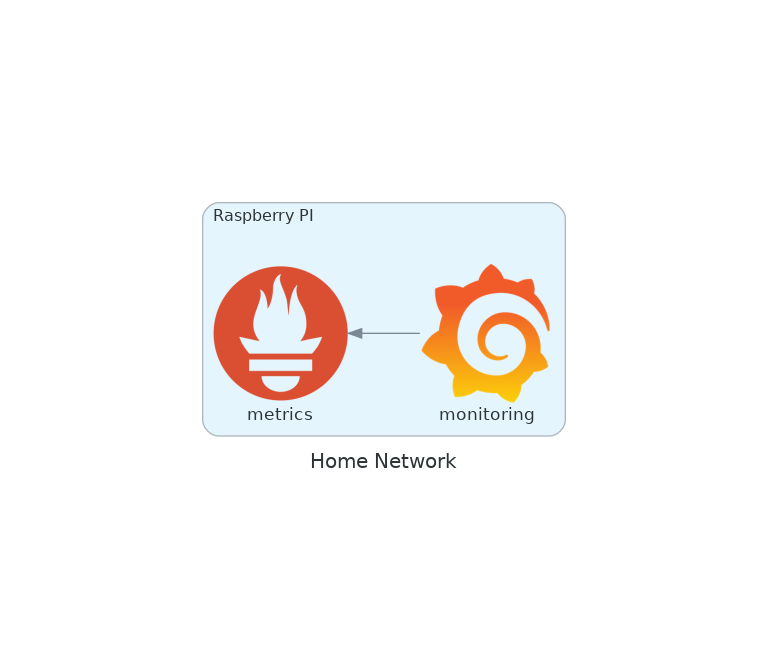

# Mucrastructure

### Prerequisites

* Have `terraform`, and `git-crypt` installed

### DNS

* Follow prerequisites
* Ensure the repository is unlocked (TODO, add a helper script to manage this)
* `cd dns && terraform init && ./terraform_apply`

### Pi

All configuration and research of my Raspberry Pi is recorded [here](pi/README.md)

### Homedirs

The old [osx-homedir](https://github.com/scottmuc/osx-homedir) repository is retired
and I am not storing configuration for all OS homedirs in [homedirs](homedirs)

### Decision Log

* Terraform + AWS because it's boring. I'm familiar with both of these technologies already. Thanks
  @jezhumble for this sharing how the [US Government manages DNS][18f-dns]
* `s3` backend for Terraform state because I repave frequently so need to ensure these files are
  stored somewhere safe.
* Separate `terraform` user created with: `IAMFullAccess`, `AmazonS3FullAccess`, and `AmazonRoute53FullAccess`
  policies. Created manually as I wasn't sure how to `terraform` the user that `terraform` runs as. Never used
  the **Access Advisor** before and it's pretty slick! (looks like I should have a [bootstrap][tf-bootstrap])
* Still using Terraform but no longer going to use AWS DNS. No need for the level of indirection. Gandi.net
  works just fine.
* Moved to storing infrastructure related secrets in this repository and securing them
  using `git-crypt`.

[18f-dns]: https://18f.gsa.gov/2018/08/15/shared-infrastructure-as-code/
[tf-bootstrap]: https://github.com/18F/dns/blob/master/terraform/bootstrap/init.tf
